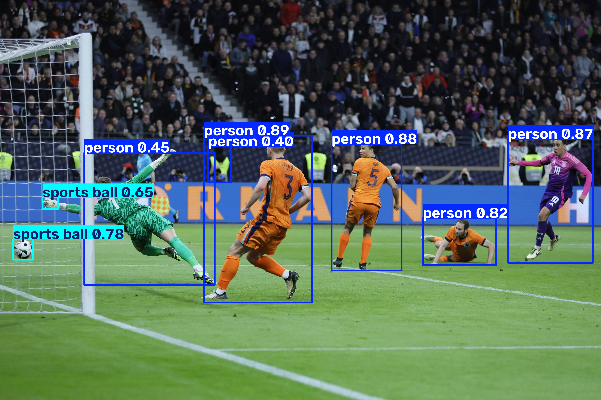

# 图像标注流程说明

## 1. 项目目标

这个案例演示了一个完整的图像标注流程：

- 使用 YOLOv11 对图片进行目标检测
- 在原图上绘制检测框和类别信息
- 保存可视化结果图片
- 生成 Pascal VOC 风格的 XML 标注文件

## 2. 整体流程

### 第一步：准备输入图片

程序先读取当前目录下的原始图片：

- 1.png

这张图片是后续检测和标注的输入。

### 第二步：加载 YOLOv11 模型

脚本会调用 Ultralytics 的 YOLO 类加载预训练模型：

- yolo11n.pt

如果模型文件不存在，程序会尝试自动下载模型权重。

### 第三步：执行目标检测

模型会对图片进行推理，输出以下信息：

- 检测到的目标类别
- 目标置信度
- 边界框坐标

### 第四步：生成可视化标注结果

检测结果会被绘制到原图上，生成新的图片：

- annotated_1.png

这一步可以直观地查看模型识别效果。

### 第五步：生成 XML 标注文件

系统还会将检测结果整理成 VOC 格式的标注文件：

- 1.xml

其中包含：

- 图片名称
- 图片尺寸
- 目标类别
- 边界框位置
- 置信度信息

## 3. 效果展示

下面是原图与标注结果的对比：

| 原始图片 | 标注结果 |
| --- | --- |
|  |  |

## 4. 主要文件说明

| 文件 | 作用 |
| --- | --- |
| yolo_annotation.py | 主程序，负责加载模型、检测图片、生成结果 |
| 1.png | 输入图片 |
| annotated_1.png | 标注后的可视化图片 |
| 1.xml | 检测结果的 XML 标注文件 |
| yolo11n.pt | YOLOv11 预训练模型 |

## 5. 运行方式

在当前目录下执行：

```bash
python yolo_annotation.py
```

运行后，程序会自动完成以下操作：

1. 读取 1.png
2. 调用 YOLOv11 进行检测
3. 保存 annotated_1.png
4. 生成 1.xml

## 6. 适用场景

这个流程适用于：

- 图像目标检测
- 数据标注自动化
- 模型效果展示
- 生成 VOC 格式标注数据
