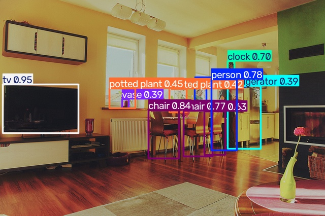

# YOLOv12 预测流程说明

## 1. 项目目标

这个脚本实现了一个完整的 YOLOv12 目标检测流程，主要包括：

- 加载 YOLOv12 模型权重
- 读取输入图片
- 对图片进行目标检测
- 将检测结果可视化并保存
- 可选地进行验证集评估

## 2. 当前脚本功能说明

脚本文件为：

- 1-yolo-predict.py

它的主要功能可以分为 4 个部分：

### 2.1 加载模型

脚本会先定位当前目录，并尝试加载本地的 YOLOv12 权重文件：

- yolov12n.pt

如果本地没有权重文件，就会尝试下载对应的 YOLOv12 权重。

### 2.2 读取输入图片

脚本读取的输入图片是：

- 000000000139.jpg

它会检查图片是否存在，如果不存在，则直接报错。

### 2.3 执行目标检测

调用 YOLO 模型对输入图片进行推理，关键参数包括：

- `conf=0.25`：置信度阈值
- `imgsz=640`：输入图片尺寸
- `stream=False`：以非流式方式返回结果

模型会输出每个检测框的类别、位置和置信度。

### 2.4 保存和展示结果

检测完成后，脚本会：

- 将标注后的图片保存为：
  - predicted_000000000139.jpg
- 尝试在窗口中展示检测结果

## 3. 业务执行流程

整个业务流程可以理解为下面几步：

1. 准备图片数据
   - 例如 000000000139.jpg
2. 加载 YOLOv12 模型
   - 从本地权重或在线下载权重
3. 输入图片进行推理
   - 生成检测框和类别信息
4. 输出可视化结果
   - 保存标注图片
5. 可选评估
   - 如果存在 coco.yaml，就进行验证集评估

## 4. 输入输出结果对比

下面是原始图片和检测后结果的直观对比：

| 原始图片 | 检测结果 |
| --- | --- |
|  |  |

## 5. 运行方式

在当前目录下执行：

```bash
python 1-yolo-predict.py
```

执行后，脚本会自动完成：

- 图片读取
- 模型推理
- 检测结果保存
- 可选的评估步骤

## 6. 关键文件说明

| 文件 | 作用 |
| --- | --- |
| 1-yolo-predict.py | YOLOv12 预测脚本 |
| 000000000139.jpg | 输入图片 |
| predicted_000000000139.jpg | 检测后的可视化图片 |
| yolov12n.pt | YOLOv12 模型权重 |
| coco.yaml | 验证集配置文件 |

## 7. 适用场景

这个脚本适用于：

- 图片目标检测
- 目标框可视化展示
- 模型推理结果保存
- YOLOv12 学习与实验
