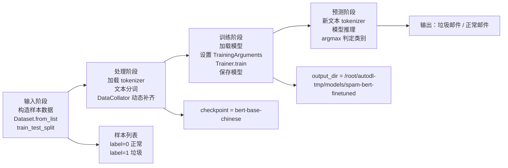
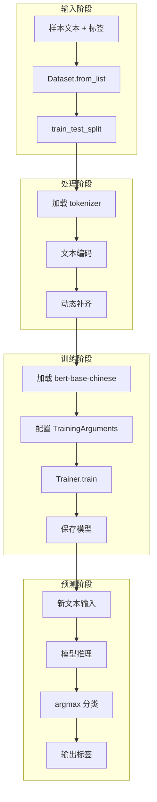

# 7-垃圾邮件分类器代码流程图版

下面这份脚本的核心目标是：

- 用一组“正常文本 / 垃圾文本”样本做二分类训练
- 使用中文 BERT 进行文本分类微调
- 训练完成后，对新的文本做“垃圾邮件 / 正常邮件”预测

## 一、整体架构：输入 → 处理 → 训练 → 预测

---

## 二、四个阶段拆解说明

### 1. 输入阶段：准备训练数据

代码先定义一个小型样本列表：

- `label=0`：正常邮件
- `label=1`：垃圾邮件

随后通过 `Dataset.from_list(data)` 将列表转换成 Hugging Face 的 `Dataset` 对象，再用 `train_test_split(test_size=0.2)` 划分出训练集和测试集。

业务含义：

- 输入数据来自“人工构造的私有样本”
- 这一步是为后续模型学习提供标注样本

### 2. 处理阶段：文本预处理与编码

核心步骤：

1. 使用 `checkpoint = "bert-base-chinese"` 作为基础模型
2. 用 `AutoTokenizer.from_pretrained(checkpoint)` 加载中文 tokenizer
3. 定义 `preprocess_function(examples)`：
   - 用 tokenizer 对文本编码
   - `truncation=True`：超长文本截断
   - `max_length=128`：最大长度限制
4. 调用 `dataset.map(preprocess_function, batched=True)` 做批量编码
5. 使用 `DataCollatorWithPadding(tokenizer=tokenizer)` 做动态补齐

业务含义：

- 把自然语言文本转换成模型可消费的 token IDs
- 让不同长度的文本在训练时能批量对齐

### 3. 训练阶段：加载模型并进行微调

核心步骤：

1. 使用 `AutoModelForSequenceClassification.from_pretrained(checkpoint, num_labels=2)` 加载中文 BERT 分类模型
2. 设置评估指标为 `accuracy`
3. 定义 `compute_metrics(eval_pred)`：
   - 从 logits 中取最大概率对应的类别
   - 与真实标签比较，计算准确率
4. 配置 `TrainingArguments`：
   - `output_dir`：保存模型路径
   - `eval_strategy="epoch"`：每轮训练结束评估
   - `save_strategy="epoch"`：每轮训练结束保存
   - `learning_rate=2e-5`
   - `per_device_train_batch_size=4`
   - `num_train_epochs=3`
5. 使用 `Trainer` 组装训练器
6. 执行 `trainer.train()` 完成微调

业务含义：

- 模型不是从零开始训练，而是“在中文 BERT 的基础上做二分类微调”
- 训练目标是使模型学会区分“正常”与“垃圾”文本

### 4. 预测阶段：对新文本进行分类推理

核心步骤：

1. 构造新的输入文本，例如：
   - `"澳门线上赌场，特价酬宾"`
2. `tokenizer(text, return_tensors="pt")` 将文本编码成张量
3. 把输入放到 `model.device` 上
4. 通过 `with torch.no_grad()` 关闭梯度计算
5. 使用 `model(**inputs).logits` 得到模型输出的类别分数
6. `logits.argmax().item()` 获取预测类别
7. 当预测类别等于 `1` 时判定为“垃圾邮件”，否则判定为“正常邮件”

业务含义：

- 训练后的模型可以拿来做真实业务决策
- 这一步是“线上服务”或“推理阶段”的典型写法

---

## 三、图解版简化流程

---

## 四、该脚本对应的业务理解

这段代码本质上属于一个“文本二分类”任务：

- 输入：用户消息/广告信息/营销短信等文本
- 处理：将文本转为模型可理解的 token 表达
- 训练：利用带标签样本学习返回的分类能力
- 预测：对新文本判断它究竟是“正常邮件”还是“垃圾邮件”

如果把它放在真实业务中，可以理解为：

- 这是一个小规模的邮件内容过滤/垃圾短信识别范式
- 训练样本越真实、越丰富，模型越能覆盖真实业务场景
